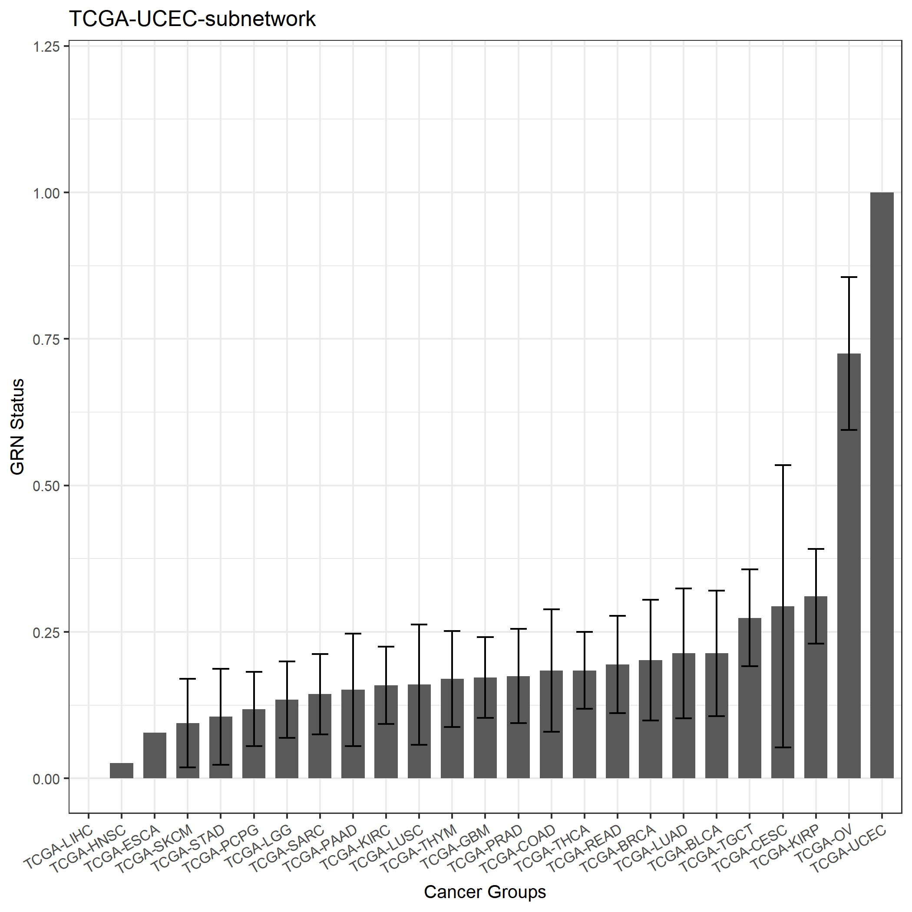
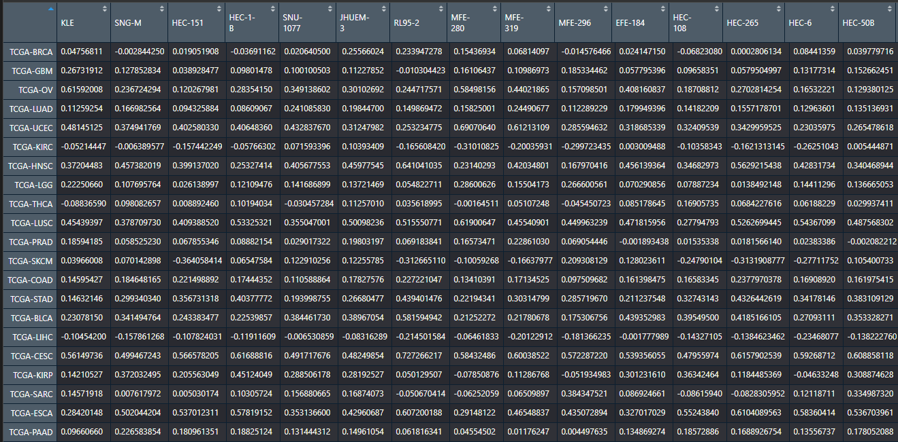
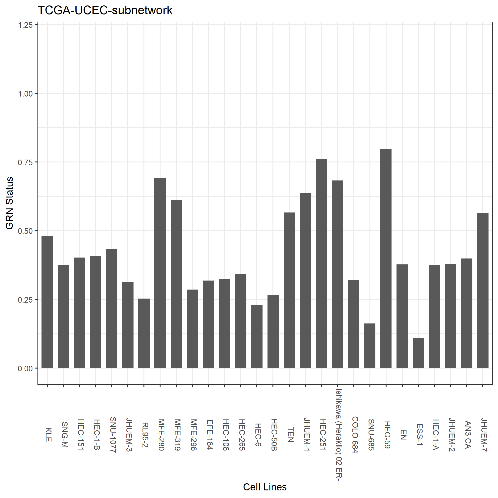
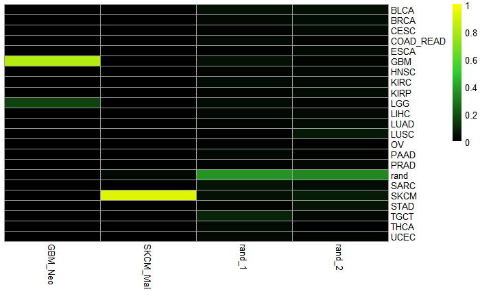

# cancerCellNet (CCN)

[1. Setup CCN](#setup_ccn) <br>
[2. Broad Training CCN](#broadTrain_ccn) <br>
[3. Broad Validation CCN](#broadVal_ccn) <br>
[4. Subclass Training CCN](#subTrain_ccn) <br>
[5. Subclass Validation CCN](#subVal_ccn) <br>
[6. Application of CCN](#app_ccn) <br>
[7. Other Tools](#other_tools) <br>
[8. Old way of Training](#old_way) <br>
[9. GRN Construction](#grn_construction) <br>
[10. GRN Status](#grn_status) <br> 
[11. TF Scores](#TF_scores) <br>
[12. scRNA-seq Aggregation](#sc_aggreate) <br >

## CancerCellNet Instructions 
CancerCellNet is a R package that allows cancer type classification and evaluation of transcriptional fidelity for cancer models across species and platform (bulk RNA-seq, microarray). Alternatively, you can visit our <a href="http://ec2-3-88-19-178.compute-1.amazonaws.com/cl_apps/cancerCellNet_web/">web-app</a>. You can also read about the applications of CancerCellNet in our <a href="https://www.biorxiv.org/content/10.1101/2020.03.27.012757v2">bioRxiv preprint</a>

We will demonstrate how to <br>
* build/apply general (broad) classifier <br>
* build/apply subclass classifier <br>
* reconstruct gene regulatory network <br>
* calcuate GRN status <br>
* calculate TF scores<br>

### <a name="setup_ccn">Set up CCN</a>
```R
library(devtools)
install_github("pcahan1/cancerCellNet", ref="master", auth="your_token_here")
install.packages("pheatmap")
install.packages("RColorBrewer")
install.packages("randomForest")
install.packages("ggplot2")
install.packages("igraph")
install.packages("stringr")
install.packages("snow")

# install packages from Bioconductor 
if (!requireNamespace("BiocManager", quietly = TRUE))
    install.packages("BiocManager")
   
BiocManager::install("AnnotationDbi")
BiocManager::install("GO.db")
BiocManager::install("org.Hs.eg.db")
```

#### Fetch the required files if you have not already donwloaded them
All the training data were compiled from the <a href="https://portal.gdc.cancer.gov/">TCGA project</a>. The example expression profiles of UCEC cell lines were extracted from <a href="https://portals.broadinstitute.org/ccle">CCLE</a>. The example expression profiles of UCEC GEMMs were taken from the study <a href="https://doi.org/10.1016/j.ccell.2015.11.005">Blaisdell et al, 2015</a> (<a href="https://www.ncbi.nlm.nih.gov/geo/query/acc.cgi?acc=GSE73541">GSE73541</a>)
```R
# fetch compiled TCGA training data 
download.file("https://cnobjects.s3.amazonaws.com/cancerCellNet/resources/Named_expGDC_20181218.rda", "Named_expGDC_20181218.rda")
download.file("https://cnobjects.s3.amazonaws.com/cancerCellNet/resources/Named_stGDC_20181218.rda", "Named_stGDC_20181218.rda")

# fetch sample cancer models 
download.file("https://cnobjects.s3.amazonaws.com/cancerCellNet/resources/CCLE_UCEC.rda", "CCLE_UCEC.rda")
download.file("https://cnobjects.s3.amazonaws.com/cancerCellNet/resources/GEMM_UCEC.rda", "GEMM_UCEC.rda")

# fetch data needed for subclass training 
download.file("https://cnobjects.s3.amazonaws.com/cancerCellNet/resources/UCEC_readyToTrain_sub_exp.rda", "UCEC_readyToTrain_sub_exp.rda")
download.file("https://cnobjects.s3.amazonaws.com/cancerCellNet/resources/UCEC_readyToTrain_sub_st.rda", "UCEC_readyToTrain_sub_st.rda")
download.file("https://cnobjects.s3.amazonaws.com/cancerCellNet/resources/BroadClassifier_return.rda", "BroadClassifier_return.rda")
download.file("https://cnobjects.s3.amazonaws.com/cancerCellNet/resources/iGenes.rda", "iGenes.rda")

```
Alternatively you can download the <a href="https://cnobjects.s3.amazonaws.com/cancerCellNet/resources/webapp/GDC_BroadTraining/stTrain_web.rda">sample table</a> and <a href=" https://cnobjects.s3.amazonaws.com/cancerCellNet/resources/webapp/GDC_BroadTraining/expTrain_web.rda">expression profile </a> of the compiled training data used in our preprint with fewer cancer categories and with COAD and READ combined into one category. 
### <a name="broadTrain_ccn">Broad Class Training</a>
Load in the necessary files first. 
```
library(cancerCellNet)
expGDC = utils_loadObject("Named_expGDC_20181218.rda")
stGDC = utils_loadObject("Named_stGDC_20181218.rda")

CCLE_sample = utils_loadObject("CCLE_UCEC.rda")
GEMM_sample = utils_loadObject("GEMM_UCEC.rda")
```
#### Find intersecting genes between query samples and training samples
```
iGenes = Reduce(intersect, list(rownames(CCLE_sample), rownames(GEMM_sample), rownames(expGDC)))
save(iGenes, file = "iGenes.rda")
```
#### Split TCGA data into training and validation 
```
stList = splitCommon_proportion(sampTab = stGDC, proportion = 0.66, dLevel = "project_id")
stTrain = stList$trainingSet
expTrain = expGDC[, stTrain$barcode]
```
#### Train the broad class classifier 
Because the training data is not balanced in this case, we would have to use stratified sampling in this case. The samplesize parameter indicates the samplesize of stratified sampling. Additionally, because the process of gene pair transform is resource intensive and time consuming, we developed a modified method to perform quick pair transform that is much quicker. 
```
broad_return = broadClass_train(stTrain = stTrain, 
                                expTrain = expTrain[iGenes, ], 
                                colName_cat = "project_id", 
                                colName_samp = "barcode", 
                                nRand = 70,
                                nTopGenes = 25, 
                                nTopGenePairs = 70, 
                                nTrees = 2000, 
                                stratify=TRUE, 
                                sampsize=60, 
                                quickPairs=TRUE)
```
### <a name="broadVal_ccn">Validate Broadclass classifier</a>
#### Classify the validation set
```
stVal_Broad = stList$validationSet
stVal_Broad_ord = stVal_Broad[order(stVal_Broad$project_id), ] #order by broadClass
expVal_Broad = expGDC[iGenes, rownames(stVal_Broad_ord)]
cnProc_broad = broad_return$cnProc #select the cnProc from the broadclass training earlier 

classMatrix_broad = broadClass_predict(cnProc_broad, expVal_Broad, nrand = 60)
```

#### Visualize the validation classification 
```
stValRand_broad = addRandToSampTab(classMatrix_broad, stVal_Broad_ord, "project_id", "barcode")
grps = as.vector(stValRand_broad$project_id)
names(grps)<-rownames(stValRand_broad)
ccn_hmClass(classMatrix_broad, grps=grps, fontsize_row=10)
```


#### Adding gaps between groups for more clear visualization 
```
breakVector = c() # create a vector of number indicating the column at which the gap will be placed 
for (uniqueClass in unique(grps)) {
   myBreak = max(which(grps %in% uniqueClass))
   breakVector = c(breakVector, myBreak)
}
ccn_hmClass(classMatrix_broad, grps=grps, fontsize_row=10, gaps_col = breakVector) 
```


#### Classifier Assessment 
```
assessmentDat = ccn_classAssess(classMatrix_broad, stValRand_broad, "project_id","barcode")
plot_class_PRs(assessmentDat)
```


#### Train a final broad class classifier using all the data 
Now that we see the broad class classifier has good performance, we can train a broad classifier with all the data. 
```
broad_return = broadClass_train(stTrain = stGDC, 
                                expTrain = expGDC[iGenes, ], 
                                colName_cat = "project_id", 
                                colName_samp = "barcode", 
                                nRand = 70,
                                nTopGenes = 25, 
                                nTopGenePairs = 70, 
                                nTrees = 2000, 
                                stratify=TRUE, 
                                sampsize=60, 
                                quickPairs=TRUE)

save(broad_return, file="BroadClassifier_return.rda")
```
### <a name="subTrain_ccn">Sub Class Training</a>

#### Load in pre-curated dataset for training subclassifier 

```
expGDC_sub = utils_loadObject("UCEC_readyToTrain_sub_exp.rda")
stGDC_sub = utils_loadObject("UCEC_readyToTrain_sub_st.rda")
returnBroad = utils_loadObject("BroadClassifier_return.rda")
iGenes = utils_loadObject("iGenes.rda")

stList_sub = splitCommon_proportion(sampTab = stGDC_sub, proportion = 0.66, dLevel = "subClass")
stTrain_sub = stList_sub$trainingSet

expTrain_sub = expGDC_sub[iGenes, as.vector(stTrain_sub$samples)]

cnProc_broad = returnBroad$cnProc
```

#### Train the subclass classifier 
In this case, majority of the rand profiles are generated from other TCGA cancer samples. But, you can still add some truly permutated profiles into the training. You can also adjust the weight of broad class classification scores as features. 
```
returnSubClass = subClass_train(cnProc_broad = cnProc_broad, stratify = TRUE, sampsize = 15, 
                                stTrain = stTrain_sub,
                                expTrain = expTrain_sub,
                                colName_broadCat = "broadClass",
                                colName_subClass = "subClass",
                                name_broadCat = "TCGA-UCEC",
                                weight_broadClass = 10,
                                colName_samp="samples",
                                nRand = 90,  
                                nTopGenes = 10,
                                nTopGenePairs = 20,
                                nTrees = 1000)
```

### <a name="subVal_ccn">Validate Subclass classifier</a>
```
stVal_Sub = stList_sub$validationSet

# to get a more even validation...better for visualizing 
stVal_split = splitCommon(sampTab = stVal_Sub, ncells = 8, dLevel = "subClass")
stVal_Sub = stVal_split$train #even though it says train, it merely contain an equally sampled dataset 


stVal_Sub_ord = stVal_Sub[order(stVal_Sub$subClass), ] #order by cateogry
expVal_sub = expGDC_sub[iGenes, rownames(stVal_Sub_ord)]
cnProc_sub = returnSubClass$cnProc

classMatrix_sub = subClass_predict(cnProc_broad, cnProc_sub, expVal_sub, nrand = 2, weight_broadClass = 10)
```

#### Visualize the classification results 
```
stValRand_sub = addRandToSampTab(classMatrix_sub, stVal_Sub_ord, "subClass", "samples")
grps = as.vector(stValRand_sub$subClass)
names(grps)<-rownames(stValRand_sub)
ccn_hmClass(classMatrix_sub, grps=grps, fontsize_row=10)
```


#### Assess the classifier 
```
assessmentDat = ccn_classAssess(classMatrix_sub, stValRand_sub, "subClass","samples")
plot_class_PRs(assessmentDat) # plot out the PR curves
```

#### Train a subclass classifier with all the data 
```
returnSubClass = subClass_train(cnProc_broad = cnProc_broad, stratify = TRUE, sampsize = 15, 
                                stTrain = stTrain_sub,
                                expTrain = expTrain_sub,
                                colName_broadCat = "broadClass",
                                colName_subClass = "subClass",
                                name_broadCat = "TCGA-UCEC",
                                weight_broadClass = 10,
                                colName_samp="samples",
                                nRand = 90,  
                                nTopGenes = 10,
                                nTopGenePairs = 20,
                                nTrees = 1000)
save(returnSubClass, file = "subClass_UCEC_return.rda")
```

### <a name="app_ccn">Apply CCN on Query</a>

#### Load in files 
```
CCLE_sample = utils_loadObject("CCLE_UCEC.rda")
GEMM_sample = utils_loadObject("GEMM_UCEC.rda")
returnBroad = utils_loadObject("BroadClassifier_return.rda")
returnSubClass = utils_loadObject("subClass_UCEC_return.rda")
cnProc_broad = returnBroad$cnProc
cnProc_subclass = returnSubClass$cnProc_subClass
```

#### Apply CCN on cancer cell-lines (broad class)
```
classMatrix_CCLE = broadClass_predict(cnProc = cnProc_broad, expDat = CCLE_sample, nrand = 2)
ccn_hmClass(classMatrix_CCLE, main = "cancer cell-lines", fontsize_row=9, fontsize_col = 10)
```


#### Apply CCN on cancer cell-lines (sub class)
```
classMatrix_CCLE_sub = subClass_predict(cnProc = cnProc_broad, cnProc_sub = cnProc_subclass, weight_broadClass = 10, expDat = CCLE_sample, nrand = 2)
ccn_hmClass(classMatrix_CCLE_sub, main = "cancer cell-lines", fontsize_row=9, fontsize_col = 10)
```


You can also apply it to GEMM samples provided above. For classifiying other GEMM samples, you may have to find the human orthologous genes between mouse and human. We built a function that can do the conversion listed below. But you can also use biomaRt to perform conversion.  
```
postConversionExpMatrix = utils_convertToGeneSymbols(expTab = preConversionExpressionMatrix, typeMusGene = TRUE)
```

### <a name="other_tools">Other Tools built into CCN</a>

#### Gene Pair Comparison Plot - using subclass as an example 
```
CCLE_sample = utils_loadObject("CCLE_UCEC.rda")
returnSubClass = utils_loadObject("subClass_UCEC_return.rda")

expGDC_sub = utils_loadObject("UCEC_readyToTrain_sub_exp.rda")
stGDC_sub = utils_loadObject("UCEC_readyToTrain_sub_st.rda")

genePairs = returnSubClass$cnProc_subClass$xpairs

# generate gene pairs 
expTransform = query_transform(expGDC_sub, genePairs) 

# average the genepair signals among TCGA samples in a category 
avgGenePair_TCGA = avgGeneCat(expDat = expTransform, sampTab = stGDC_sub, dLevel = "subClass", sampID = "samples")

genePairs_query = query_transform(CCLE_sample, genePairs)

geneCompareMatrix = makeGeneCompareTab(queryExpTab = genePairs_query,
                                       avgGeneTab = avgGenePair_TCGA, geneSamples = genePairs)
plotGeneComparison(geneCompareMatrix, fontsize_row = 7)
```

#### Gene Expression Comparison Plot - using subclass as an example
```
CCLE_sample = utils_loadObject("CCLE_UCEC.rda")
returnSubClass = utils_loadObject("subClass_UCEC_return.rda")

expGDC_sub = utils_loadObject("UCEC_readyToTrain_sub_exp.rda")
stGDC_sub = utils_loadObject("UCEC_readyToTrain_sub_st.rda")

iGenes = utils_loadObject("iGenes.rda")
cGenesList = returnSubClass$cgenes_list

# get the genes that contribute to the creating of genepairs 
genePairs = returnSubClass$cnProc_subClass$xpairs
cgenes = strsplit(x = genePairs, split = "_")
cgenes = unique(unlist(cgenes))

# create annotation table of classy genes and its corresponding category 
annoDf = data.frame(matrix(nrow = length(cgenes), ncol = 1))
colnames(annoDf) = "ClassificationCat"
rownames(annoDf) = cgenes

for (setName in names(cGenesList)) {
   geneSet = cGenesList[[setName]]
   
   annoDf[rownames(annoDf) %in% geneSet, "ClassificationCat"] = setName
   
}

expNorm = trans_prop(weighted_down(expGDC_sub[iGenes, ], 5e5, dThresh=0.25), 1e5)
# average the gene expression among TCGA samples in a category 
avgGene_TCGA = avgGeneCat(expDat = expNorm, sampTab = stGDC_sub, dLevel = "subClass", sampID = "samples")


query_expNorm = trans_prop(weighted_down(CCLE_sample[iGenes, ], 5e5, dThresh=0.25), 1e5)

geneCompareMatrix = makeGeneCompareTab(queryExpTab = query_expNorm,
                                       avgGeneTab = avgGene_TCGA, geneSamples = cgenes)
plotGeneComparison(geneCompareMatrix[rownames(annoDf), ], fontsize_row = 7, annotation_row = annoDf)

```


### <a name="old_way">Old way of Training - Broad</a>
The old way of training instead of having one packaged function 
```
library(cancerCellNet)
expGDC = utils_loadObject("Named_expGDC_20181218.rda")
stGDC = utils_loadObject("Named_stGDC_20181218.rda")

CCLE_sample = utils_loadObject("CCLE_UCEC.rda")
GEMM_sample = utils_loadObject("GEMM_UCEC.rda")

iGenes = Reduce(intersect, list(rownames(CCLE_sample), rownames(GEMM_sample), rownames(expGDC)))
expGDC = expGDC[iGenes, ]
```
The old way is basically running functions packed in broadClass_Train function individually. 
```
expTnorm = trans_prop(weighted_down(expTrain, 5e5, dThresh=0.25), 1e5)

# find genes with different expression in each cancer category 
system.time(cgenes<-findClassyGenes(expTnorm, stTrain, "description2", topX=20))

cgenesA = cgenes[['cgenes']]
grps = cgenes[['grps']]
cgenes_list = cgenes[['labelled_cgenes']]

# find top differentiating gene pairs 
system.time(xpairs<-ptGetTop(expTrain[cgenesA,], grps, cgenes_list, topX=50, sliceSize=2000, quickPairs=TRUE)) # if you don't want quick pairs, turn it off. 

# some of these might include selection cassettes; remove them
xi = setdiff(1:length(xpairs), grep("selection", xpairs))
xpairs = xpairs[xi]

# pair transform training data 
system.time(pdTrain<-query_transform(expTrain[cgenesA, ], xpairs))

tspRF = makeClassifier(pdTrain[xpairs,], genes=xpairs, groups=grps, nRand = 20, ntrees = 2000, stratify=TRUE, sampsize=60)
cnProc = list("cgenes"= cgenesA, "xpairs"=xpairs, "grps"= grps, "classifier" = tspRF)

# after the cnProc is generated, you can save it and use it to perform classification. This is a slightly less storage method of training
```
### <a name="grn_construction"> GRN Reconstruction </a>
The GRN reconstruction method is based on our previously developed method that can be found <a href="https://www.ncbi.nlm.nih.gov/pmc/articles/PMC4233680/">here</a>.
 ```
library(cancercellNet)

# load in the training samples and intersecting genes between training sample and query samples 
expGDC = utils_loadObject("Named_expGDC_20181218.rda")
stGDC = utils_loadObject("Named_stGDC_20181218.rda")
iGenes = utils_loadObject("iGenes.rda")
expGDC = expGDC[iGenes, ]

# evenly samples 80 samples per cancer type for training 
stList = splitCommon(sampTab = stGDC, ncells = 80, dLevel = "project_id")
stTrain = stList$train
save(stList, file = "stList_grn.rda")

expTrain = expGDC[,rownames(stTrain)]

# normalize the training data 
expTrain = trans_prop(weighted_down(expTrain, 5e5, dThresh=0.25), 1e5)

# GRN reconstruction 
grnAll = ccn_makeGRN(expTrain, stTrain, "project_id", zThresh = 4, dLevelGK = NULL, prune = TRUE, holm = 1e-4, cval=0.3)
save(grnAll, file = "grnAll.rda")
```
### <a name="grn_status">Rank-based GRN Status</a>
Different from our previously developed method, we devised a method that uses the rank of gene epxressions rather than the expression values. 

#### 1. Calculate Normalization Parameters 
```
library(cancerCellNet)
library(ggplot2)

# load in training expression file 
expGDC = utils_loadObject("Named_expGDC_20181218.rda")
iGenes = utils_loadObject("iGenes.rda")

# load in splitted training sample table 
stList = utils_loadObject("stList_grn.rda")
expTrain = expGDC[iGenes, rownames(stList$train)]
stTrain = stList$train

# rank the genes then log the rank. We found that it works pretty well with just ranking the genes without log. 
expTrain = logRank(expTrain, base = 0)

# load in the constructed GRN
grn_all = utils_loadObject("grnAll.rda")

# load in constructed classifier. We use the gene pairs selected for classification to determine the weight of genes in the GRN status calculation
classyReturn = utils_loadObject("BroadClassifier_return.rda")
cnProc = classyReturn$cnProc

# extract the importance of genes based on the classifier 
geneImportance = processImportance(classifier = cnProc$classifier, xpairs = classyReturn$xpairs_list, prune = TRUE)

# training normalization parameters 
trainNormParam = ccn_trainNorm(expTrain, stTrain, subNets=grn_all$ctGRNs$geneLists, classList = geneImportance, dLevel = "project_id", sidCol = "barcode", classWeight = TRUE, exprWeight = FALSE, meanNorm = TRUE)

save(trainNormParam, file = "trainingNormalization.rda")
```
You can also visualize the GRN status of training samples. 

```
# get the GRN status matrix 
GRN_mean = trainNormParam$trainingScores

# select the GRN status for UCEC GRN
temp_mean = GRN_mean[GRN_mean$subNet == "TCGA-UCEC", ]

ggplot(data = temp_mean) +
        geom_bar(stat="identity", data = temp_mean, aes(x=reorder(grp_name, mean), y=mean), width = 0.7) +
        geom_errorbar(aes(ymin=mean - stdev, ymax = mean + stdev, x = grp_name), width = 0.5)+
        ggtitle(paste0("TCGA-UCEC-subnetwork")) +
        ylim(0, 1.2)+
        xlab("Cancer Groups")+
        ylab("GRN Status")+
        #geom_hline(yintercept=1, linetype="dashed", color = "steelblue")+
        theme_bw()+
        theme(text = element_text(size=10),legend.position="none",axis.text.x = element_text(angle = 30, hjust = 1))
```


#### 2. Calculate GRN Status for Query Data 

```
library(cancerCellNet)
# load in GRN network 
grn_all = utils_loadObject("grnAll.rda")

# load in classifier 
classReturn = utils_loadObject("BroadClassifier_return.rda")

# load in normalization parameters 
trainNorm_param = utils_loadObject("trainingNormalization.rda")

iGenes = utils_loadObject("iGenes.rda")

CCL_samples = utils_loadObject("CCLE_UCEC.rda")
CCL_samples = CCL_samples[iGenes, ]

# rank the query sample genes 
CCL_query = logRank(CCL_samples, base = 0)

GRN_statusQuery = ccn_queryGRNstatus(expQuery = CCL_query, grn_return = grn_all, trainNorm = trainNorm_param, classifier_return = classReturn, prune = TRUE)    
```
The output is a matrix with samples as column names and cancer types as row names. The values indicate the query sample's GRN status of in cancer specific subnetwork. 



You can visualize GRN status of a cancer by
```
plotDf = data.frame("CellLines" = colnames(GRN_statusQuery),
                  "GRN_Status" = as.vector(GRN_statusQuery["TCGA-UCEC, ]))
plotDf$CellLines <- factor(plotDf$CellLines, levels = plotDf$CellLines)

ggplot(data = plotDf) +
   geom_bar(stat="identity", data = plotDf, aes(x=CellLines, y=GRN_Status), width = 0.7) +
   ggtitle("TCGA-UCEC-subnetwork") +
   xlab("Cell Lines")+
   ylab("GRN Status")+
   #geom_hline(yintercept=1, linetype="dashed", color = "steelblue")+
   theme_bw()+
   theme(text = element_text(size=10),legend.position="none",axis.text.x = element_text(angle = 270, vjust=0.2))
```


### <a name="TF_scores">TF Scores</a>
TF scores are metric indicating the importance of transcription factors in establishing cancer type specific gene regulatory network. The magnitude of the score indicates the importance of the transcription factor. If the TF score is a positive number, it indicate that the TF should be more upregulated to have similar GRN to the desired cancer type. If the TF score is a negative number, it indicates that the TF should be downregulated to have similar GRN to the desired cancer type. 

```
library(cancerCellNet)
# load in GRN network 
grn_all = utils_loadObject("grnAll.rda")

# load in classifier 
classReturn = utils_loadObject("BroadClassifier_return.rda")

# load in normalization parameters 
trainNorm_param = utils_loadObject("trainingNormalization.rda")

iGenes = utils_loadObject("iGenes.rda")

CCL_samples = utils_loadObject("CCLE_UCEC.rda")
CCL_samples = CCL_samples[iGenes, ]

# rank the query sample genes 
CCL_query = logRank(CCL_samples, base = 0)
TF_scores = ccn_tfScores(expQuery = CCL_query, subnetName = "TCGA-UCEC", grnAll = grn_all, trainNorm = trainNorm_param, classifier_return = classReturn, exprWeight = FALSE, normTFscore = TRUE)
```
The output should be a matrix with TF as row names and samples as column names. 


### <a name="sc_aggreate">scRNA-seq Aggregation</a>
In order to apply classifier on scRNA-seq profiles, you would have to aggregate the expression profiles within the same cluster label or cell type label. You can download a compiled sample <a href="https://cnobjects.s3.amazonaws.com/cancerCellNet/resources/sample_scRNA_exp.rda">scRNA expression profile</a> and <a href="https://cnobjects.s3.amazonaws.com/cancerCellNet/resources/sample_scRNA_st.rda">sample table</a> to follow along with the demonstration. The compiled sample scRNA data were from <a href="https://www.sciencedirect.com/science/article/pii/S0092867418311784">Jerby-Arnon, L. et al.</a> and <a href="https://www.ncbi.nlm.nih.gov/pmc/articles/PMC5810554/"> Darmanis, S. et al.  </a>

```
scRNA_exp = utils_loadObject("sample_scRNA_exp.rda")
scRNA_st = utils_loadObject("sample_scRNA_st.rda")
agg_list = aggregate_scProfiles(scRNA_exp, scRNA_st, cell_id_col = "cell_id", group_id_col = "cell_type")
classMatrix_broad = broadClass_predict(broad_return$cnProc, agg_list$agg_exp, nrand = 2)

ccn_hmClass(classMatrix_broad, fontsize_col = 10, fontsize_row=10)
```

