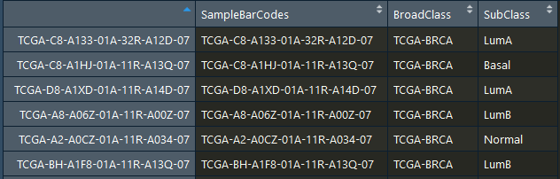
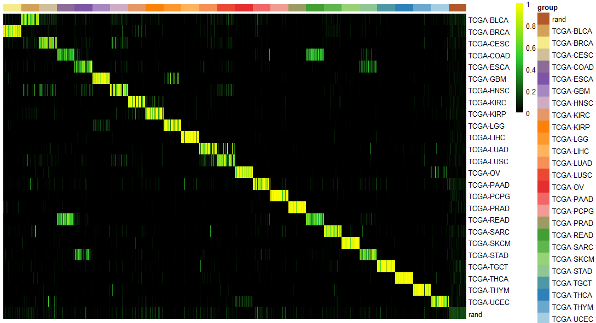
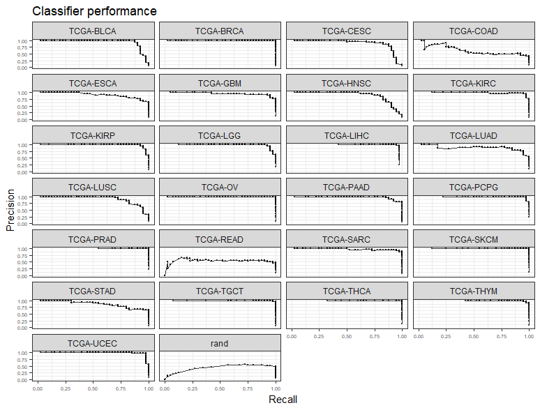
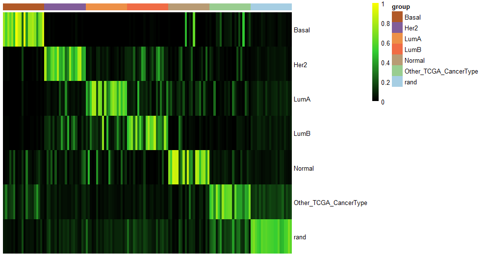
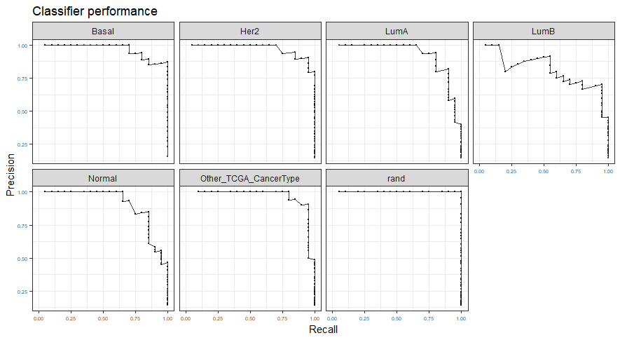
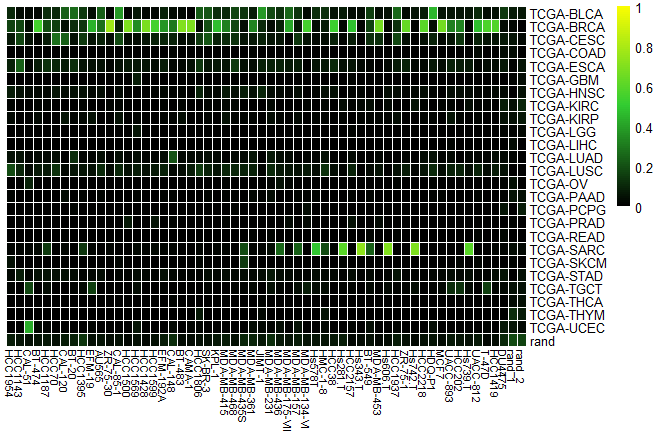
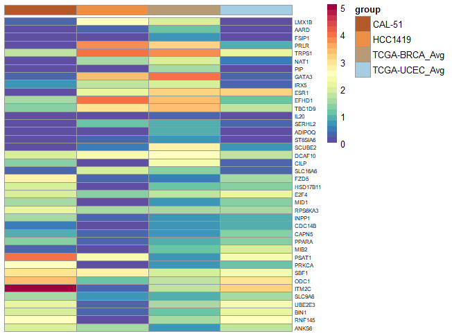
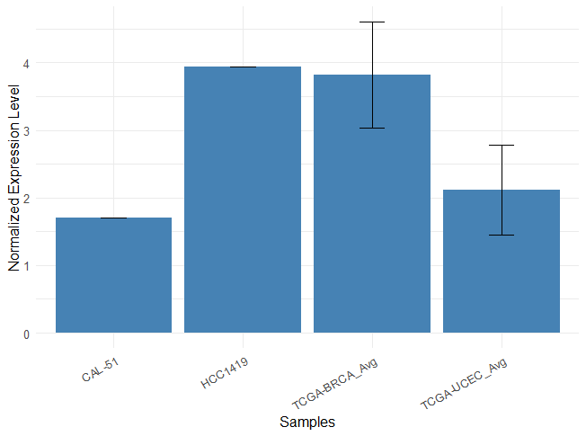
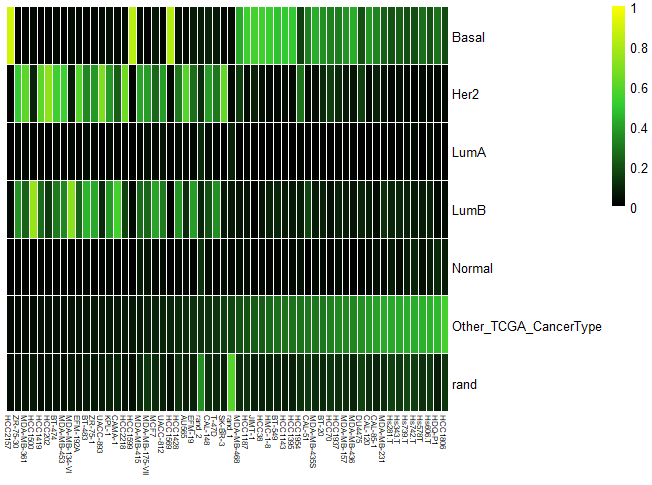

# cancerCellNet (CCN)

[Shortcut to Setup CCN](#setup_ccn)

[Shortcut to Broad Training CCN](#broadTrain_ccn)

[Shortcut to Subclass Training CCN](#subTrain_ccn)

[Shortcut to Broad Validation CCN](#broadVal_ccn)

[Shortcut to Subclass Validation CCN](#subVal_ccn)

[Shortcut to Application of CCN](#app_BRCA)

[Shortcut to Application of Broad Classifier on BRCA CCLE data](#app_broad)

[Shortcut to Gene Visualization/Comparison Tool](#gene_comp)

[Shortcut to subclass application on BRCA CCLE data](#sub_app)

#### <a name="setup_ccn">Setting up CCN</a>
```R
library(devtools)
install_github("pcahan1/cancerCellNet", ref="master", auth="your_token_here")
install.packages("pheatmap")
install.packages("RColorBrewer")
install.packages("randomForest")
install.packages("ggplot2")
```

### Fetch the required files if you have not already donwloaded them
```R
download.file("https://s3.amazonaws.com/cnobjects/cancerCellNet/resources/BroadClassifier_return_20190118.rda", "BroadClassifier_return_20190118.rda")

download.file("https://s3.amazonaws.com/cnobjects/cancerCellNet/resources/ExampleSampTab_20190118.rda", "ExampleSampTab_20190118.rda")

download.file("https://s3.amazonaws.com/cnobjects/cancerCellNet/resources/expGDC_raw_20190118.rda", "expGDC_raw_20190118.rda")

download.file("https://s3.amazonaws.com/cnobjects/cancerCellNet/resources/intersecting_genes_20190120.rda", "intersecting_genes_20190120.rda")

download.file("https://s3.amazonaws.com/cnobjects/cancerCellNet/resources/SubClassifier_return_20190118.rda", "SubClassifier_return_20190118.rda")
```

### <a name="broadTrain_ccn">Broad Class Training</a>
```R
library(cancerCellNet)
expGDC = utils_loadObject("expGDC_raw_20190118.rda")
exampleSampTab = utils_loadObject("ExampleSampTab_20190118.rda")
iGenes = utils_loadObject("intersecting_genes_20190120.rda")

exampleSampTab
```
Load in the training data, example sample table and intersecting genes. 



The sample table shown above maps each sample in the training data to a broad class and a sub class. 
```R
stList = splitCommon(exampleSampTab, ncells=40, dLevel = "BroadClass")
stTrain = stList[[1]]

expTrain = expGDC[iGenes, as.vector(stTrain$SampleBarCodes)]

returnBroad = broadClass_train(stTrain = stTrain, expTrain = expTrain, colName_cat = "BroadClass", colName_samp = "SampleBarCodes")
save(returnBroad, file="BroadClassifier_return.rda")
```
Randomly select 40 training samples in each broad category using "splitCommon" function and pass into "broadClass_train" for training a broad classifier. 

```R
names(returnBroad)
[1] "expTnorm"    "sampTab"     "cgenes_list" "cnProc"
```
In the returnBroad list, there are 4 items. "expTnorm" is the normalized expression matrix for the training samples. "sampTab" is the sample table of training samples. "cgenes_list" is a named list with all the genes belonging in each category. "cnProc" is a list that contains various components needed for prediction including the classifier object. 

### <a name="subTrain_ccn">Subclass Training</a>
To start the subclass training, you need the cnProc from the broad class training. 

```R
stList_sub = splitCommon(exampleSampTab, ncells=20, dLevel="SubClass")
stTrain_sub = stList_sub[[1]]

expTrain_sub = expGDC[iGenes, as.vector(stTrain_sub$SampleBarCodes)]
cnProc_broad = returnBroad$cnProc

returnSubClass = subClass_train(cnProc_broad = cnProc_broad, stTrain = stTrain_sub, expTrain = expTrain_sub, colName_broadCat = "BroadClass", colName_subClass = "SubClass", name_broadCat = "TCGA-BRCA", colName_samp="SampleBarCodes")
save(returnSubClass, file="SubClassifier_return.rda")
```
### <a name="broadVal_ccn">BroadClass Validation</a>

```R
# use the samples that are not used in training as validation samples to see how well the classifier performs
stValList_Broad = splitCommon(stList[[2]], ncells=40, dLevel="BroadClass") #because not all the cancer broad category have the same amount of samples, going to select the same amount validation samples for even comparison
stVal_Broad = stValList_Broad[[1]]

stVal_Broad_ord = stVal_Broad[order(stVal_Broad$BroadClass), ] #order by broadClass
expVal_Broad = expGDC[iGenes, rownames(stVal_Broad_ord)]
cnProc_broad = returnBroad$cnProc #select the cnProc from the broadclass training earlier 
classMatrix_broad = broadClass_predict(cnProc_broad, expVal_Broad, nrand = 40)
```
After getting the classification matrix, you can plot it. 

```R
stValRand_broad = addRandToSampTab(classMatrix_broad, stVal_Broad_ord, "BroadClass", "SampleBarCodes")
grps = as.vector(stValRand_broad$BroadClass)
names(grps)<-rownames(stValRand_broad)
ccn_hmClass(classMatrix_broad, grps=grps, fontsize_row=10)
```


You can also assess the performance of Broadclass classifier through PR cruves . 

```R
# assessment
assessmentDat = ccn_classAssess(classMatrix_broad, stValRand_broad, "BroadClass","SampleBarCodes")
plot_class_PRs(assessmentDat) # plot out the PR curves
```


### <a name="subVal_ccn">SubClass Validation</a>

```R
stValList_sub = splitCommon(stList_sub[[2]], ncells=20, dLevel="SubClass")
stVal_Sub = stValList_sub[[1]]
stVal_Sub_ord = stVal_Sub[order(stVal_Sub$SubClass), ] #order by cateogry
expVal_sub = expGDC[iGenes, rownames(stVal_Sub_ord)]

cnProc_sub = returnSubClass$cnProc
classMatrix_sub = subClass_predict(cnProc_broad, cnProc_sub, expVal_sub, nrand = 20)
```
To classify subclasses, you need the cnProc of broad class classifier. 

```R
stValRand_sub = addRandToSampTab(classMatrix_sub, stVal_Sub_ord, "SubClass", "SampleBarCodes")
grps = as.vector(stValRand_sub$SubClass)
names(grps)<-rownames(stValRand_sub)
ccn_hmClass(classMatrix_sub, grps=grps, fontsize_row=10)
```


You can also assess the subclass classifier 
```R
assessmentDat = ccn_classAssess(classMatrix_sub, stValRand_sub, "SubClass","SampleBarCodes")
plot_class_PRs(assessmentDat) # plot out the PR curves
```


##<a name="app_BRCA">Application of classifiers</a>

###<a name="app_broad">Application of Broad classifer on BRCA CCLE data </a>

```R
library(cancerCellNet)
BRCA_CCLE = utils_loadObject("CCLE_BRCA.rda")

returnBroad = utils_loadObject("BroadClassifier_return.rda")

expTnorm_broad = returnBroad[["expTnorm"]]
sampTab_broad = returnBroad[["sampTab"]]
cgenes_list_broad = returnBroad[["cgenes_list"]]
cnProc_broad = returnBroad[["cnProc"]]

classMatrix_broad = broadClass_predict(cnProc = cnProc_broad, expDat = BRCA_CCLE, nrand = 2)
ccn_hmClass(classMatrix_broad, fontsize_row=10, fontsize_col = 8)
```


###<a name="gene_comp">Gene Visualization/Comparison Tool</a>
```R
TCGA_geneAvg = avgGeneCat(expDat = expTnorm_broad, sampTab = sampTab_broad, dLevel = "BroadClass", sampID = "SampleBarCodes")
BRCAnorm = trans_prop(weighted_down(BRCA_CCLE, 5e5, dThresh=0.25), 1e5)

BRCAgenes = cgenes_list_broad$`TCGA-BRCA`

geneCompareMatrix = makeGeneCompareTab(queryExpTab = BRCAnorm, avgGeneTab = TCGA_geneAvg, querySample = c("CAL-51", "HCC1419"), trainingCat = c("TCGA-BRCA_Avg", "TCGA-UCEC_Avg"), geneSamples = BRCAgenes)

plotGeneComparison(geneCompareMatrix)
```


You can also plot barplots for a single gene of interest 
```R
sdGene = sdGeneCat(expDat = expTnorm_broad, sampTab = sampTab_broad, dLevel = "BroadClass", sampID = "SampleBarCodes")
barPlotGene(geneCompareMatrix, sdGeneCat = sdGene, gene = "TRPS1")
```


###<a name="sub_app">Subclassify BRCA CCLE data</a>
```R
broadReturn = utils_loadObject("BroadClassifier_return.rda")
subReturn = utils_loadObject("SubClassifier_return.rda")
BRCA_CCLE = utils_loadObject("CCLE_BRCA.rda")

broad_cnProc = broadReturn$cnProc
sub_cnProc = subReturn$cnProc_subClass

CCLE_eval = subClass_predict(cnProc_broad = broad_cnProc, cnProc_sub = sub_cnProc, expDat = BRCA_CCLE, nrand=2)
CCLE_evalOrd = CCLE_eval[, order(CCLE_eval[6, ])]

ccn_hmClass(CCLE_evalOrd, fontsize_row=10, fontsize_col = 6)
```


