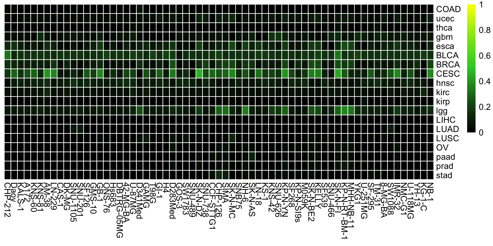

# cancerCellNet (cCN)


#### Setup
```R
library(devtools)
install_github("pcahan1/cancerCellNet", ref="master", auth="your_token_here")
library(cancerCellNet)

```

#### Load cnProc and query data
```R
mydate<-utils_myDate()
cnProc<-utils_loadObject("cnProc_cancer_Mar_23_2018.rda")
v.genes<-rownames(cnProc$expTrain)
length(v.genes)
[1] 19398

expQList<-utils_loadObject("expGeneList_lgg-CCLE.R")
stQuery<-utils_loadObject("sampTab_lgg-CCLE_QC.R")
```

#### Transform query data
```R
expQuery<-expQList[['counts']][v.genes,]
expQueryNorm<-trans_rnaseq(expQuery, 1e5)
```

#### Analyze query data and plot
```R
lgg_res<-cn_apply(expQueryNorm, stQuery, cnProc)
cn_HmClass(lgg_res, isBig=F)
fname<-paste0("hmClass_lgg_", mydate, ".png")
dev.copy(png, file=fname, units='in',width=8, height=4, res=300)
dev.off()
```



####cnProc files:

| DATE | cnProc | 
|------|--------|
| Mar_23_2018 | [Download](https://s3.amazonaws.com/cellnet-rnaseq/ref/cnproc/HS/cnProc_cancer_Mar_23_2018.rda) |


