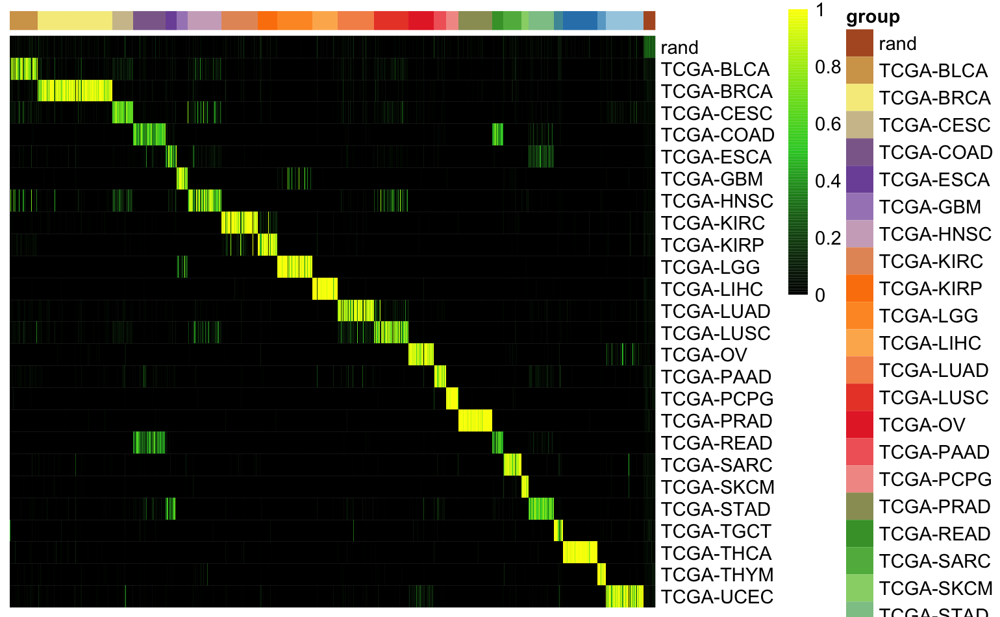
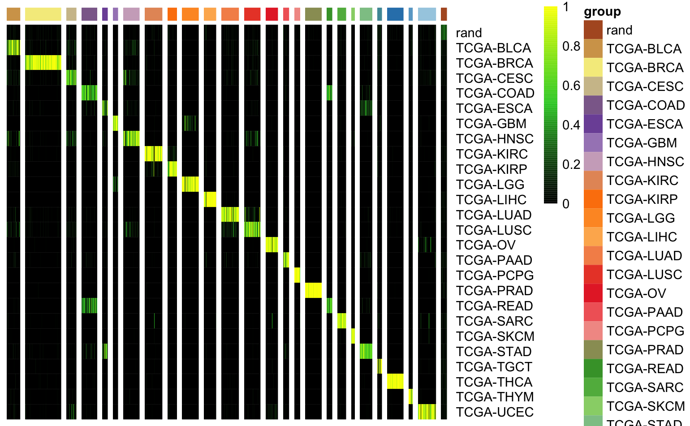
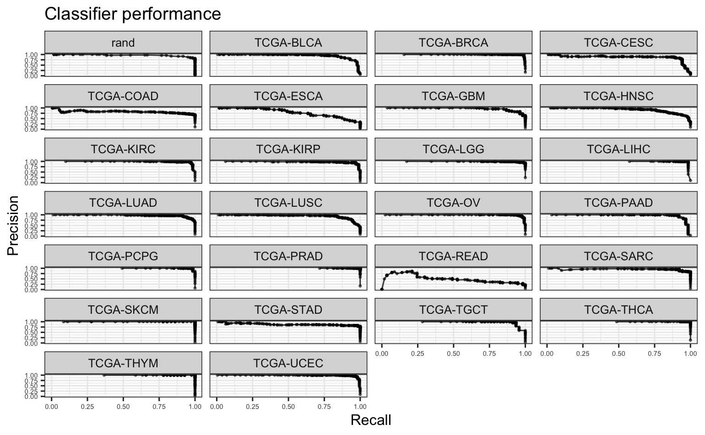
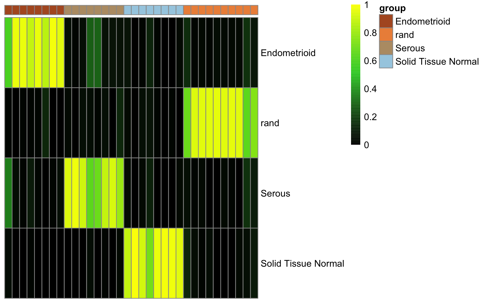
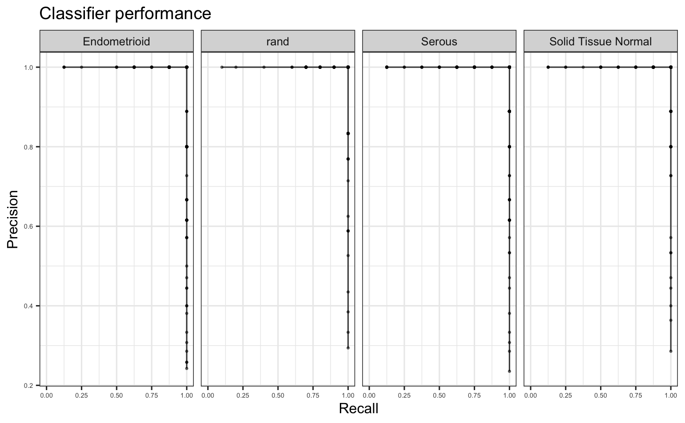
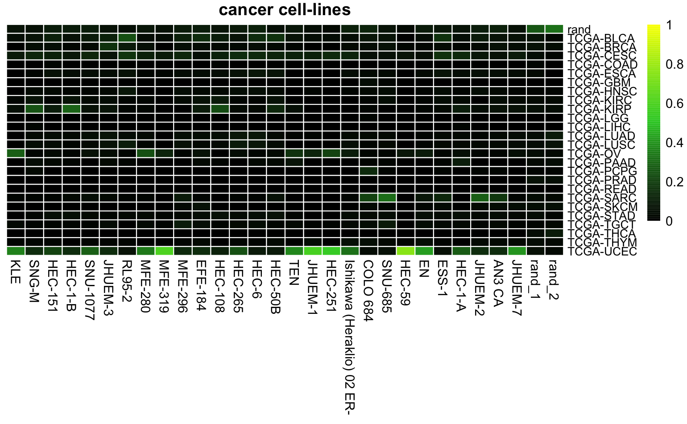
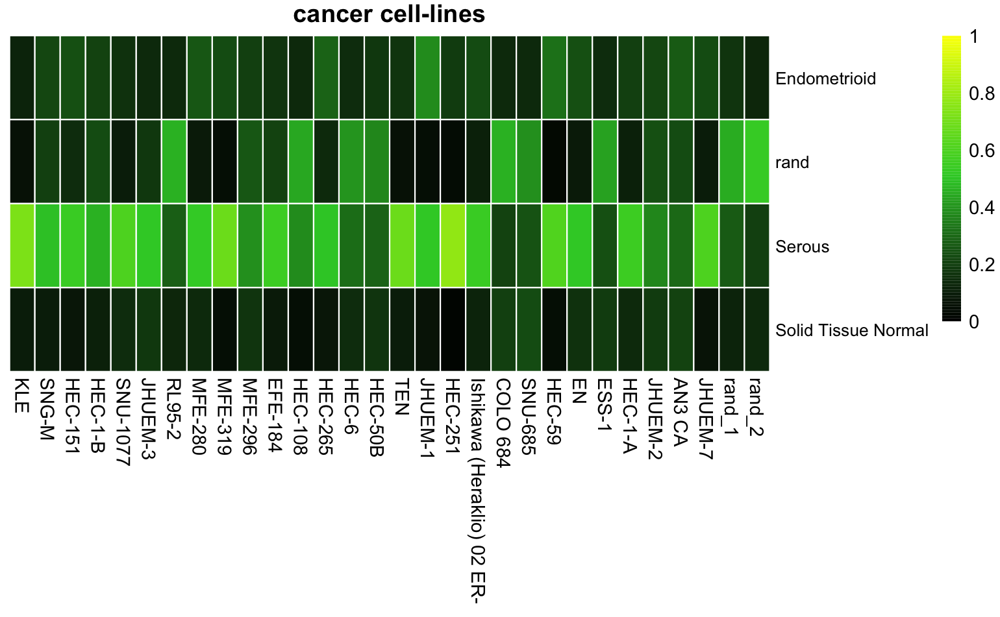
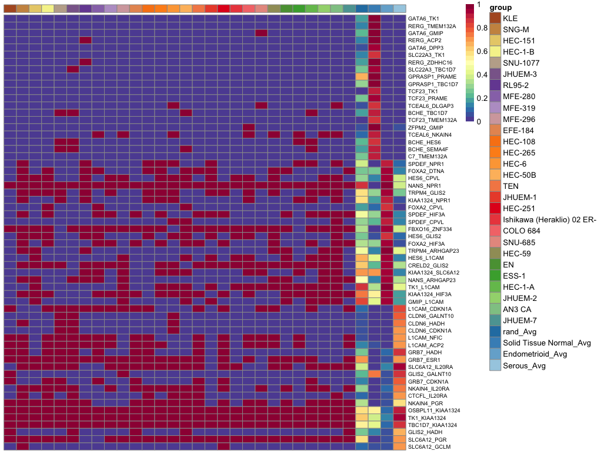
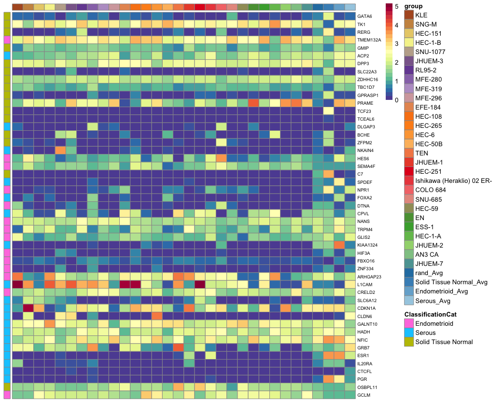

# cancerCellNet (CCN)

[1. Shortcut to Setup CCN](#setup_ccn)

[2. Shortcut to Broad Training CCN](#broadTrain_ccn)

[3. Shortcut to Broad Validation CCN](#broadVal_ccn)

[4. Shortcut to Subclass Training CCN](#subTrain_ccn)

[5. Shortcut to Subclass Validation CCN](#subVal_ccn)

[6. Shortcut to Application of CCN](#app_ccn)

[7. Shortcut to Other Tools](#other_tools)

[8. Shortcut to Old way of Training](#old_way)
### <a name="setup_ccn">Set up CCN</a>
```R
library(devtools)
install_github("pcahan1/cancerCellNet", ref="master", auth="your_token_here")
install.packages("pheatmap")
install.packages("RColorBrewer")
install.packages("randomForest")
install.packages("ggplot2")
```

#### Fetch the required files if you have not already donwloaded them
```R
# fetch compiled TCGA training data 
download.file("https://cnobjects.s3.amazonaws.com/cancerCellNet/resources/Named_expGDC_20181218.rda", "Named_expGDC_20181218.rda")
download.file("https://cnobjects.s3.amazonaws.com/cancerCellNet/resources/Named_stGDC_20181218.rda", "Named_stGDC_20181218.rda")

# fetch sample cancer models 
download.file("https://cnobjects.s3.amazonaws.com/cancerCellNet/resources/CCLE_UCEC.rda", "CCLE_UCEC.rda")
download.file("https://cnobjects.s3.amazonaws.com/cancerCellNet/resources/GEMM_UCEC.rda", "GEMM_UCEC.rda")

# fetch data needed for subclass training 
download.file("https://cnobjects.s3.amazonaws.com/cancerCellNet/resources/UCEC_readyToTrain_sub_exp.rda", "UCEC_readyToTrain_sub_exp.rda")
download.file("https://cnobjects.s3.amazonaws.com/cancerCellNet/resources/UCEC_readyToTrain_sub_st.rda", "UCEC_readyToTrain_sub_st.rda")
download.file("https://cnobjects.s3.amazonaws.com/cancerCellNet/resources/BroadClassifier_return.rda", "BroadClassifier_return.rda")
download.file("https://cnobjects.s3.amazonaws.com/cancerCellNet/resources/iGenes.rda", "iGenes.rda")

```

### <a name="broadTrain_ccn">Broad Class Training</a>
Load in the necessary files first. 
```
library(cancerCellNet)
expGDC = utils_loadObject("Named_expGDC_20181218.rda")
stGDC = utils_loadObject("Named_stGDC_20181218.rda")

CCLE_sample = utils_loadObject("CCLE_UCEC.rda")
GEMM_sample = utils_loadObject("GEMM_UCEC.rda")
```
#### Find intersecting genes between query samples and training samples
```
iGenes = Reduce(intersect, list(rownames(CCLE_sample), rownames(GEMM_sample), rownames(expGDC)))
save(iGenes, file = "iGenes.rda")
```
#### Split TCGA data into training and validation 
```
stList = splitCommon_proportion(sampTab = stGDC, proportion = 0.66, dLevel = "project_id")
stTrain = stList$trainingSet
expTrain = expGDC[, stTrain$barcode]
```
#### Train the broad class classifier 
Because the training data is not balanced in this case, we would have to use stratified sampling in this case. The samplesize parameter indicates the samplesize of stratified sampling. Additionally, because the process of gene pair transform is resource intensive and time consuming, we developed a modified method to perform quick pair transform that is much quicker. 
```
broad_return = broadClass_train(stTrain = stTrain, 
                                expTrain = expTrain[iGenes, ], 
                                colName_cat = "project_id", 
                                colName_samp = "barcode", 
                                nRand = 70,
                                nTopGenes = 25, 
                                nTopGenePairs = 70, 
                                nTrees = 2000, 
                                stratify=TRUE, 
                                sampsize=60, 
                                quickPairs=TRUE)
```
### <a name="broadVal_ccn">Validate Broadclass classifier</a>
#### Classify the validation set
```
stVal_Broad = stList$validationSet
stVal_Broad_ord = stVal_Broad[order(stVal_Broad$project_id), ] #order by broadClass
expVal_Broad = expGDC[iGenes, rownames(stVal_Broad_ord)]
cnProc_broad = broad_return$cnProc #select the cnProc from the broadclass training earlier 

classMatrix_broad = broadClass_predict(cnProc_broad, expVal_Broad, nrand = 60)
```

#### Visualize the validation classification 
```
stValRand_broad = addRandToSampTab(classMatrix_broad, stVal_Broad_ord, "project_id", "barcode")
grps = as.vector(stValRand_broad$project_id)
names(grps)<-rownames(stValRand_broad)
ccn_hmClass(classMatrix_broad, grps=grps, fontsize_row=10)
```


#### Adding gaps between groups for more clear visualization 
```
breakVector = c() # create a vector of number indicating the column at which the gap will be placed 
for (uniqueClass in unique(grps)) {
   myBreak = max(which(grps %in% uniqueClass))
   breakVector = c(breakVector, myBreak)
}
ccn_hmClass(classMatrix_broad, grps=grps, fontsize_row=10, gaps_col = breakVector) 
```



#### Classifier Assessment 
```
assessmentDat = ccn_classAssess(classMatrix_broad, stValRand_broad, "project_id","barcode")
plot_class_PRs(assessmentDat)
```


#### Train a final broad class classifier using all the data 
Now that we see the broad class classifier has good performance, we can train a broad classifier with all the data. 
```
broad_return = broadClass_train(stTrain = stGDC, 
                                expTrain = expGDC[iGenes, ], 
                                colName_cat = "project_id", 
                                colName_samp = "barcode", 
                                nRand = 70,
                                nTopGenes = 25, 
                                nTopGenePairs = 70, 
                                nTrees = 2000, 
                                stratify=TRUE, 
                                sampsize=60, 
                                quickPairs=TRUE)

save(broad_return, file="BroadClassifier_return.rda")
```
### <a name="subTrain_ccn">Sub Class Training</a>

#### Load in pre-curated dataset for training subclassifier 

```
expGDC_sub = utils_loadObject("UCEC_readyToTrain_sub_exp.rda")
stGDC_sub = utils_loadObject("UCEC_readyToTrain_sub_st.rda")
returnBroad = utils_loadObject("BroadClassifier_return.rda")
iGenes = utils_loadObject("iGenes.rda")

stList_sub = splitCommon_proportion(sampTab = stGDC_sub, proportion = 0.66, dLevel = "subClass")
stTrain_sub = stList_sub$trainingSet

expTrain_sub = expGDC_sub[iGenes, as.vector(stTrain_sub$samples)]

cnProc_broad = returnBroad$cnProc
```

#### Train the subclass classifier 
In this case, majority of the rand profiles are generated from other TCGA cancer samples. But, you can still add some truly permutated profiles into the training. You can also adjust the weight of broad class classification scores as features. 
```
returnSubClass = subClass_train(cnProc_broad = cnProc_broad, stratify = TRUE, sampsize = 15, 
                                stTrain = stTrain_sub,
                                expTrain = expTrain_sub,
                                colName_broadCat = "broadClass",
                                colName_subClass = "subClass",
                                name_broadCat = "TCGA-UCEC",
                                weight_broadClass = 10,
                                colName_samp="samples",
                                nRand = 90,  
                                nTopGenes = 10,
                                nTopGenePairs = 20,
                                nTrees = 1000)
```

### <a name="subVal_ccn">Validate Subclass classifier</a>
```
stVal_Sub = stList_sub$validationSet

# to get a more even validation...better for visualizing 
stVal_split = splitCommon(sampTab = stVal_Sub, ncells = 8, dLevel = "subClass")
stVal_Sub = stVal_split$train #even though it says train, it merely contain an equally sampled dataset 


stVal_Sub_ord = stVal_Sub[order(stVal_Sub$subClass), ] #order by cateogry
expVal_sub = expGDC_sub[iGenes, rownames(stVal_Sub_ord)]
cnProc_sub = returnSubClass$cnProc

classMatrix_sub = subClass_predict(cnProc_broad, cnProc_sub, expVal_sub, nrand = 2, weight_broadClass = 10)
```

#### Visualize the classification results 
```
stValRand_sub = addRandToSampTab(classMatrix_sub, stVal_Sub_ord, "subClass", "samples")
grps = as.vector(stValRand_sub$subClass)
names(grps)<-rownames(stValRand_sub)
ccn_hmClass(classMatrix_sub, grps=grps, fontsize_row=10)
```


#### Assess the classifier 
```
assessmentDat = ccn_classAssess(classMatrix_sub, stValRand_sub, "subClass","samples")
plot_class_PRs(assessmentDat) # plot out the PR curves
```

#### Train a subclass classifier with all the data 
```
returnSubClass = subClass_train(cnProc_broad = cnProc_broad, stratify = TRUE, sampsize = 15, 
                                stTrain = stTrain_sub,
                                expTrain = expTrain_sub,
                                colName_broadCat = "broadClass",
                                colName_subClass = "subClass",
                                name_broadCat = "TCGA-UCEC",
                                weight_broadClass = 10,
                                colName_samp="samples",
                                nRand = 90,  
                                nTopGenes = 10,
                                nTopGenePairs = 20,
                                nTrees = 1000)
save(returnSubClass, file = "subClass_UCEC_return.rda")
```

### <a name="app_ccn">Apply CCN on Query</a>

#### Load in files 
```
CCLE_sample = utils_loadObject("CCLE_UCEC.rda")
GEMM_sample = utils_loadObject("GEMM_UCEC.rda")
returnBroad = utils_loadObject("BroadClassifier_return.rda")
returnSubClass = utils_loadObject("subClass_UCEC_return.rda")
cnProc_broad = returnBroad$cnProc
cnProc_subclass = returnSubClass$cnProc_subClass
```

#### Apply CCN on cancer cell-lines (broad class)
```
classMatrix_CCLE = broadClass_predict(cnProc = cnProc_broad, expDat = CCLE_sample, nrand = 2)
ccn_hmClass(classMatrix_CCLE, main = "cancer cell-lines", fontsize_row=9, fontsize_col = 10)
```


#### Apply CCN on cancer cell-lines (sub class)
```
classMatrix_CCLE_sub = subClass_predict(cnProc = cnProc_broad, cnProc_sub = cnProc_subclass, weight_broadClass = 10, expDat = CCLE_sample, nrand = 2)
ccn_hmClass(classMatrix_CCLE_sub, main = "cancer cell-lines", fontsize_row=9, fontsize_col = 10)
```


You can also apply it to GEMM samples provided above. For classifiying other GEMM samples, you may have to find the human orthologous genes between mouse and human. We built a function that can do the conversion listed below. But you can also use biomaRt to perform conversion.  
```
postConversionExpMatrix = utils_convertToGeneSymbols(expTab = preConversionExpressionMatrix, typeMusGene = TRUE)
```

### <a name="other_tools">Other Tools built into CCN</a>

#### Gene Pair Comparison Plot - using subclass as an example 
```
CCLE_sample = utils_loadObject("CCLE_UCEC.rda")
returnSubClass = utils_loadObject("subClass_UCEC_return.rda")

expGDC_sub = utils_loadObject("UCEC_readyToTrain_sub_exp.rda")
stGDC_sub = utils_loadObject("UCEC_readyToTrain_sub_st.rda")

genePairs = returnSubClass$cnProc_subClass$xpairs

# generate gene pairs 
expTransform = query_transform(expGDC_sub, genePairs) 

# average the genepair signals among TCGA samples in a category 
avgGenePair_TCGA = avgGeneCat(expDat = expTransform, sampTab = stGDC_sub, dLevel = "subClass", sampID = "samples")

genePairs_query = query_transform(CCLE_sample, genePairs)

geneCompareMatrix = makeGeneCompareTab(queryExpTab = genePairs_query,
                                       avgGeneTab = avgGenePair_TCGA, geneSamples = genePairs)
plotGeneComparison(geneCompareMatrix, fontsize_row = 7)
```

#### Gene Expression Comparison Plot - using subclass as an example
```
CCLE_sample = utils_loadObject("CCLE_UCEC.rda")
returnSubClass = utils_loadObject("subClass_UCEC_return.rda")

expGDC_sub = utils_loadObject("UCEC_readyToTrain_sub_exp.rda")
stGDC_sub = utils_loadObject("UCEC_readyToTrain_sub_st.rda")

iGenes = utils_loadObject("iGenes.rda")
cGenesList = returnSubClass$cgenes_list

# get the genes that contribute to the creating of genepairs 
genePairs = returnSubClass$cnProc_subClass$xpairs
cgenes = strsplit(x = genePairs, split = "_")
cgenes = unique(unlist(cgenes))

# create annotation table of classy genes and its corresponding category 
annoDf = data.frame(matrix(nrow = length(cgenes), ncol = 1))
colnames(annoDf) = "ClassificationCat"
rownames(annoDf) = cgenes

for (setName in names(cGenesList)) {
   geneSet = cGenesList[[setName]]
   
   annoDf[rownames(annoDf) %in% geneSet, "ClassificationCat"] = setName
   
}

expNorm = trans_prop(weighted_down(expGDC_sub[iGenes, ], 5e5, dThresh=0.25), 1e5)
# average the gene expression among TCGA samples in a category 
avgGene_TCGA = avgGeneCat(expDat = expNorm, sampTab = stGDC_sub, dLevel = "subClass", sampID = "samples")


query_expNorm = trans_prop(weighted_down(CCLE_sample[iGenes, ], 5e5, dThresh=0.25), 1e5)

geneCompareMatrix = makeGeneCompareTab(queryExpTab = query_expNorm,
                                       avgGeneTab = avgGene_TCGA, geneSamples = cgenes)
plotGeneComparison(geneCompareMatrix[rownames(annoDf), ], fontsize_row = 7, annotation_row = annoDf)

```


### <a name="old_way">Old way of Training - Broad</a>
The old way of training instead of having one packaged function 
```
library(cancerCellNet)
expGDC = utils_loadObject("Named_expGDC_20181218.rda")
stGDC = utils_loadObject("Named_stGDC_20181218.rda")

CCLE_sample = utils_loadObject("CCLE_UCEC.rda")
GEMM_sample = utils_loadObject("GEMM_UCEC.rda")

iGenes = Reduce(intersect, list(rownames(CCLE_sample), rownames(GEMM_sample), rownames(expGDC)))
expGDC = expGDC[iGenes, ]
```
The old way is basically running functions packed in broadClass_Train function individually. 
```
expTnorm = trans_prop(weighted_down(expTrain, 5e5, dThresh=0.25), 1e5)

# find genes with different expression in each cancer category 
system.time(cgenes<-findClassyGenes(expTnorm, stTrain, "description2", topX=20))

cgenesA = cgenes[['cgenes']]
grps = cgenes[['grps']]
cgenes_list = cgenes[['labelled_cgenes']]

# find top differentiating gene pairs 
system.time(xpairs<-ptGetTop(expTrain[cgenesA,], grps, cgenes_list, topX=50, sliceSize=2000, quickPairs=TRUE)) # if you don't want quick pairs, turn it off. 

# some of these might include selection cassettes; remove them
xi = setdiff(1:length(xpairs), grep("selection", xpairs))
xpairs = xpairs[xi]

# pair transform training data 
system.time(pdTrain<-query_transform(expTrain[cgenesA, ], xpairs))

tspRF = makeClassifier(pdTrain[xpairs,], genes=xpairs, groups=grps, nRand = 20, ntrees = 2000, stratify=TRUE, sampsize=60)
cnProc = list("cgenes"= cgenesA, "xpairs"=xpairs, "grps"= grps, "classifier" = tspRF)

# after the cnProc is generated, you can save it and use it to perform classification. This is a slightly less storage method of training
```


