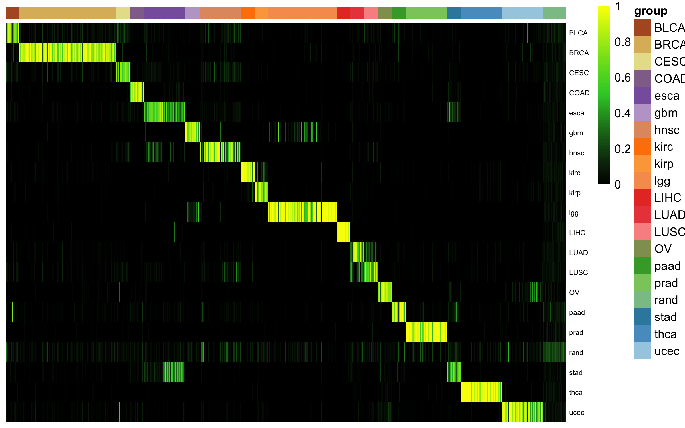

# cancerCellNet (cCN)

[Shortcut to bulk using CCN](#using_ccn)

[Shortcut to training CCN](#training_ccn)

#### <a name="using_ccn">Using CCN</a>

This is a cursory walk-thru for using cancerCellNet. In addition to the R package, you will also need a few files:

- (classifier list)[https://s3.amazonaws.com/cnobjects/cancerCellNet/resources/ccn_classifier_Jun_29_2018.rda]
- (held out valdiation expression data)[https://s3.amazonaws.com/cnobjects/cancerCellNet/resources/expHeldOut_Jun_30_2018.rda]
- (held out valdiation meta data table)[https://s3.amazonaws.com/cnobjects/cancerCellNet/resources/stHeldOut_Jun_30_2018.rda]

#### Setup
```R
library(devtools)
install_github("pcahan1/cancerCellNet", ref="master", auth="your_token_here")
library(cancerCellNet)

library(RColorBrewer)
library(pheatmap)
library(randomForest)
library(ggplot2)
```

### Fetch the required files if you have not already donwloaded them
#### Fetch the data (optional if you have alread done this)
```R
download.file("https://s3.amazonaws.com/cnobjects/cancerCellNet/resources/ccn_classifier_Jun_29_2018.rda", "ccn_classifier_Jun_29_2018.rda")

download.file("https://s3.amazonaws.com/cnobjects/cancerCellNet/resources/expHeldOut_Jun_30_2018.rda", "expHeldOut_Jun_29_2018.rda")

download.file("https://s3.amazonaws.com/cnobjects/cancerCellNet/resources/stHeldOut_Jun_30_2018.rda", "stHeldOut_Jun_29_2018.rda")

```

#### Load Classifier list and held-out validation data
```R
mydate<-utils_myDate()
ccnList<-utils_loadObject("ccn_classifier_Jun_29_2018.rda")
rf_tsp<-ccnList[['classifier']]
cgenes<-ccnList[['cgenes']]
xpairs<-ccnList[['xpairs']]

expVal<-utils_loadObject("expHeldOut_Jun_30_2018.rda")
stVal<-utils_loadObject("stHeldOut_Jun_30_2018.rda")
```

#### Transform the query/validation data
```R
expValTrans<-query_transform(expVal[cgenes,], xpairs)
```

#### Classify the query/validation data, and add some randomized profiles, too
```R
nrand<-50
classRes_val<-rf_classPredict(rf_tsp, expValTrans, numRand=nrand)
```

The results of the analysis ^above^ are different than the traditional CellNet in that they only (for now) return a classification matrix.

#### Plot the classification results
```R
stValRand<-addRandToSampTab(classRes_val, stVal, "description2", "sample_name")
grps<-as.vector(stValRand$description2)
names(grps)<-rownames(stValRand)
ccn_hmClass(classRes_val, grps=grps, fontsize=6)
```



Use cnn_classAssess() and plot_class_PRs() to assess the performance of this classifier.

For the CCLE analysis, write a function to reorder the classRes columns in increasing order of target tumor category.

#### <a name="training_ccn">Training CCN</a>
Below, we alk through the steps in making and assessing a CCN classifier. Because it is critical that the query data have the same genes as the classifier, we also show how to limit the possible genes going into CCN prior to training.

Here are the files that you need:

- (Raw PDX data)[https://s3.amazonaws.com/cnobjects/cancerCellNet/resources/expRaw_pdx_070618.rda]
- (Raw TCGA data)[https://s3.amazonaws.com/cnobjects/cancerCellNet/resources/expTCGA_Raw_Good_Jun_27_2018.rda]
- (TCGA meta data table)[https://s3.amazonaws.com/cnobjects/cancerCellNet/resources/stTCGA_Raw_Good_Jun_27_2018.rda]
- (Gene table)[https://s3.amazonaws.com/cnobjects/cancerCellNet/resources/geneToTrans_Homo_sapiens_pc.only.GRCh38.80.exo_Feb_23_2018.rda]

You can fetch them using the download.file() function as shown above.


Find genes in common to CCLE/TCGA and PDX
```R
library(cancerCellNet)

goTab<-utils_loadObject("geneToTrans_Homo_sapiens_pc.only.GRCh38.80.exo_Feb_23_2018.rda")
length(unique(goTab$gene_name))
[1] 19734

ugenes<-unique(as.vector(goTab$gene_name)

expPDX<-utils_loadObject("expRaw_pdx_070618.rda")

genesPDX<-rownames(expPDX)

ugenes<-intersect(ugenes, genesPDX)

length(ugenes)

expPDX<-expPDX[ugenes,]
```

Load the TCGA data, and split into training and validation set
```R
stTCGA<-utils_loadObject("stTCGA_Raw_Good_Jun_27_2018.rda")
expTCGA<-utils_loadObject("expTCGA_Raw_Good_Jun_27_2018.rda")

expTCGA<-expTCGA[ugenes,]

stList<-splitCommon(stTCGA, ncells=30, dLevel="description2")
stTrain<-stList[[1]]

expTrain<-expTCGA[,rownames(stTrain)]

```

normalize training data and find classy genes
```R
expTnorm<-trans_prop(weighted_down(expTrain, 5e5), 1e5)
system.time(cgenes<-findClassyGenes(expTnorm, stTrain, "description2", topX=20))
   user  system elapsed 
 48.867   8.732  58.208 

cgenesA<-cgenes[['cgenes']]
grps<-cgenes[['grps']]
length(cgenesA)
731 # might differ for you

hm_gpa_sel(expTnorm, cgenesA, grps, maxPerGrp=25, toScale=T, cRow=F, cCol=F,font=4)
```

transform the training data
```R
system.time(pairDat<-pair_transform(expTrain[cgenesA,]))

   user  system elapsed 
601.236 257.128 878.092
```

find best pairs
```R
system.time(xpairs<-gnrBP(pairDat, grps))
```

train classifier
```R
system.time(tspRF<-sc_makeClassifier(pairDat[xpairs,], genes=xpairs, groups=grps, nRand=30, ntrees=1000))
  user  system elapsed 
 22.173   0.148  22.472
```

Now you can apply this to the held out validation data (sampTab is the 2nd item in the stList), and to the PDX data ...


