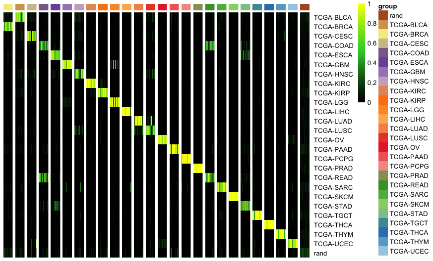
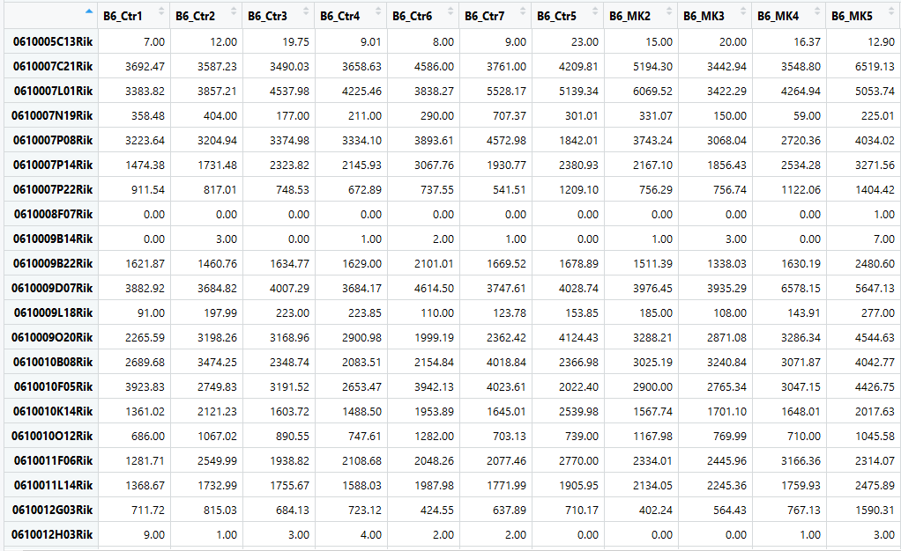
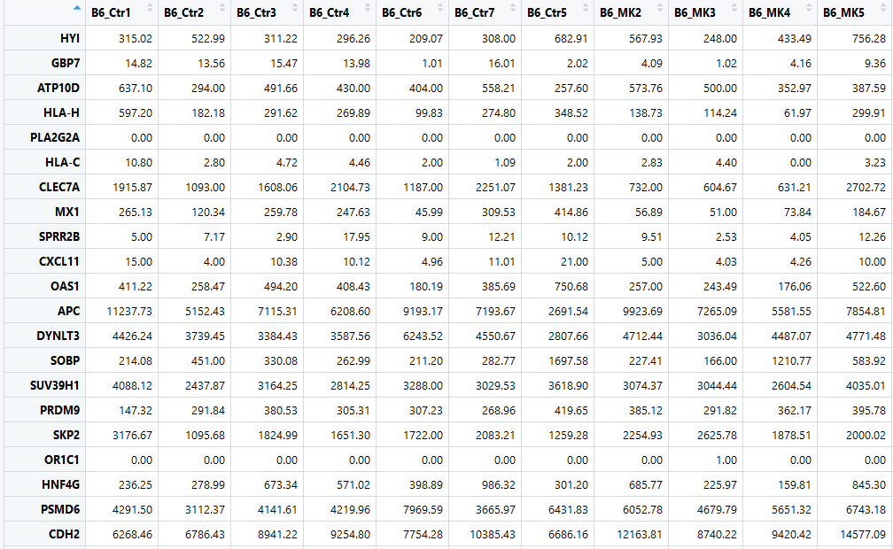
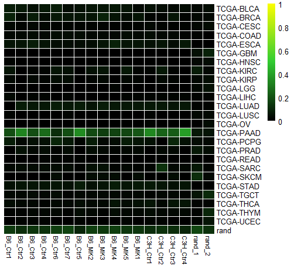
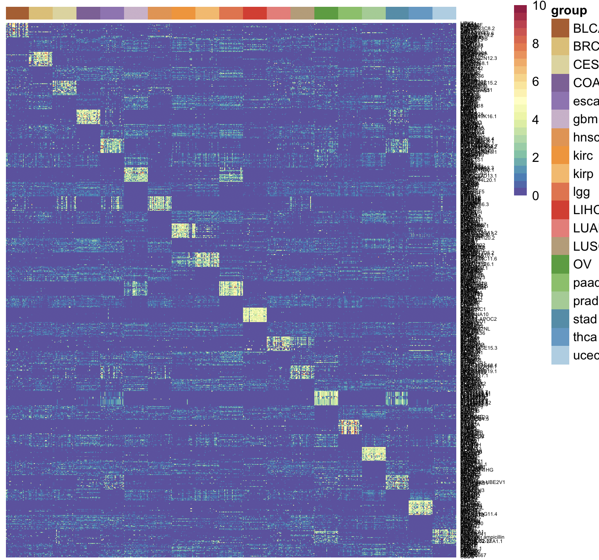

<<<<<<< HEAD
# cancerCellNet (CCN)

[Shortcut to Setup CCN](#setup_ccn)

[Shortcut to Broad Training CCN](#broadTrain_ccn)

[Shortcut to Subclass Training CCN](#subTrain_ccn)

[Shortcut to Broad Validation CCN](#broadVal_ccn)

[Shortcut to Subclass Validation CCN](#subVal_ccn)

[Shortcut to Application of CCN](#app_BRCA)

[Shortcut to Application of Broad Classifier on BRCA CCLE data](#app_broad)

[Shortcut to Gene Visualization/Comparison Tool](#gene_comp)

[Shortcut to subclass application on BRCA CCLE data](#sub_app)

[Shortcut to class application on PAAD GEMM data](#GEMM_geneConvert)

#### <a name="setup_ccn">Setting up CCN</a>
```R
library(devtools)
install_github("pcahan1/cancerCellNet", ref="master", auth="your_token_here")
install.packages("pheatmap")
install.packages("RColorBrewer")
install.packages("randomForest")
install.packages("ggplot2")
```

### Fetch the required files if you have not already donwloaded them
```R
download.file("https://s3.amazonaws.com/cnobjects/cancerCellNet/resources/BroadClassifier_return_20190118.rda", "BroadClassifier_return_20190118.rda")

download.file("https://s3.amazonaws.com/cnobjects/cancerCellNet/resources/ExampleSampTab_20190118.rda", "ExampleSampTab_20190118.rda")

download.file("https://s3.amazonaws.com/cnobjects/cancerCellNet/resources/expGDC_raw_20190118.rda", "expGDC_raw_20190118.rda")

download.file("https://s3.amazonaws.com/cnobjects/cancerCellNet/resources/intersecting_genes_20190120.rda", "intersecting_genes_20190120.rda")

download.file("https://s3.amazonaws.com/cnobjects/cancerCellNet/resources/SubClassifier_return_20190118.rda", "SubClassifier_return_20190118.rda")

download.file("https://s3.amazonaws.com/cnobjects/cancerCellNet/resources/GSE102598_LL_RNAseq_2017_rsem_est_counts_mm9_unique.csv", "GSE102598_LL_RNAseq_2017_rsem_est_counts_mm9_unique.csv")
```

### <a name="broadTrain_ccn">Broad Class Training</a>
```R
library(cancerCellNet)
expGDC = utils_loadObject("expGDC_raw_20190118.rda")
exampleSampTab = utils_loadObject("ExampleSampTab_20190118.rda")
iGenes = utils_loadObject("intersecting_genes_20190120.rda")

exampleSampTab
```
Load in the training data, example sample table and intersecting genes. 


The sample table shown above maps each sample in the training data to a broad class and a sub class. 
```R
stList = splitCommon(exampleSampTab, ncells=40, dLevel = "BroadClass")
stTrain = stList[[1]]

expTrain = expGDC[iGenes, as.vector(stTrain$SampleBarCodes)]

returnBroad = broadClass_train(stTrain = stTrain, expTrain = expTrain, colName_cat = "BroadClass", colName_samp = "SampleBarCodes")
save(returnBroad, file="BroadClassifier_return.rda")
```
Randomly select 40 training samples in each broad category using "splitCommon" function and pass into "broadClass_train" for training a broad classifier. 

```R
names(returnBroad)
[1] "expTnorm"    "sampTab"     "cgenes_list" "cnProc"
```
In the returnBroad list, there are 4 items. "expTnorm" is the normalized expression matrix for the training samples. "sampTab" is the sample table of training samples. "cgenes_list" is a named list with all the genes belonging in each category. "cnProc" is a list that contains various components needed for prediction including the classifier object. 

### <a name="subTrain_ccn">Subclass Training</a>
To start the subclass training, you need the cnProc from the broad class training. 

```R
stList_sub = splitCommon(exampleSampTab, ncells=20, dLevel="SubClass")
stTrain_sub = stList_sub[[1]]

expTrain_sub = expGDC[iGenes, as.vector(stTrain_sub$SampleBarCodes)]
cnProc_broad = returnBroad$cnProc

returnSubClass = subClass_train(cnProc_broad = cnProc_broad, stTrain = stTrain_sub, expTrain = expTrain_sub, colName_broadCat = "BroadClass", colName_subClass = "SubClass", name_broadCat = "TCGA-BRCA", colName_samp="SampleBarCodes")
save(returnSubClass, file="SubClassifier_return.rda")
```
### <a name="broadVal_ccn">BroadClass Validation</a>

```R
# use the samples that are not used in training as validation samples to see how well the classifier performs
stValList_Broad = splitCommon(stList[[2]], ncells=40, dLevel="BroadClass") #because not all the cancer broad category have the same amount of samples, going to select the same amount validation samples for even comparison
stVal_Broad = stValList_Broad[[1]]

stVal_Broad_ord = stVal_Broad[order(stVal_Broad$BroadClass), ] #order by broadClass
expVal_Broad = expGDC[iGenes, rownames(stVal_Broad_ord)]
cnProc_broad = returnBroad$cnProc #select the cnProc from the broadclass training earlier 
classMatrix_broad = broadClass_predict(cnProc_broad, expVal_Broad, nrand = 40)
```
After getting the classification matrix, you can plot it. 

```R
stValRand_broad = addRandToSampTab(classMatrix_broad, stVal_Broad_ord, "BroadClass", "SampleBarCodes")
grps = as.vector(stValRand_broad$BroadClass)
names(grps)<-rownames(stValRand_broad)
ccn_hmClass(classMatrix_broad, grps=grps, fontsize_row=10)
```


You can also add gaps between each groups 
```R
breakVector = c() # create a vector of number indicating the column at which the gap will be placed 
for (uniqueClass in unique(grps)) {
   myBreak = max(which(grps %in% uniqueClass))
   breakVector = c(breakVector, myBreak)
}
ccn_hmClass(classMatrix_broad, grps=grps, fontsize_row=10, gaps_col = breakVector) 
```


You can also assess the performance of Broadclass classifier through PR cruves . 

```R
# assessment
assessmentDat = ccn_classAssess(classMatrix_broad, stValRand_broad, "BroadClass","SampleBarCodes")
plot_class_PRs(assessmentDat) # plot out the PR curves
```


### <a name="subVal_ccn">SubClass Validation</a>

```R
stValList_sub = splitCommon(stList_sub[[2]], ncells=20, dLevel="SubClass")
stVal_Sub = stValList_sub[[1]]
stVal_Sub_ord = stVal_Sub[order(stVal_Sub$SubClass), ] #order by cateogry
expVal_sub = expGDC[iGenes, rownames(stVal_Sub_ord)]

cnProc_sub = returnSubClass$cnProc
classMatrix_sub = subClass_predict(cnProc_broad, cnProc_sub, expVal_sub, nrand = 20)
```
To classify subclasses, you need the cnProc of broad class classifier. 

```R
stValRand_sub = addRandToSampTab(classMatrix_sub, stVal_Sub_ord, "SubClass", "SampleBarCodes")
grps = as.vector(stValRand_sub$SubClass)
names(grps)<-rownames(stValRand_sub)
ccn_hmClass(classMatrix_sub, grps=grps, fontsize_row=10)
```


You can also assess the subclass classifier 
```R
assessmentDat = ccn_classAssess(classMatrix_sub, stValRand_sub, "SubClass","SampleBarCodes")
plot_class_PRs(assessmentDat) # plot out the PR curves
```


## <a name="app_BRCA">Application of classifiers</a>

### <a name="app_broad">Application of Broad classifer on BRCA CCLE data </a>

```R
library(cancerCellNet)
BRCA_CCLE = utils_loadObject("CCLE_BRCA.rda")

returnBroad = utils_loadObject("BroadClassifier_return.rda")

expTnorm_broad = returnBroad[["expTnorm"]]
sampTab_broad = returnBroad[["sampTab"]]
cgenes_list_broad = returnBroad[["cgenes_list"]]
cnProc_broad = returnBroad[["cnProc"]]

classMatrix_broad = broadClass_predict(cnProc = cnProc_broad, expDat = BRCA_CCLE, nrand = 2)
ccn_hmClass(classMatrix_broad, fontsize_row=10, fontsize_col = 8)
```


### <a name="gene_comp">Gene Visualization/Comparison Tool</a>
```R
TCGA_geneAvg = avgGeneCat(expDat = expTnorm_broad, sampTab = sampTab_broad, dLevel = "BroadClass", sampID = "SampleBarCodes")
BRCAnorm = trans_prop(weighted_down(BRCA_CCLE, 5e5, dThresh=0.25), 1e5)

BRCAgenes = cgenes_list_broad$`TCGA-BRCA`

geneCompareMatrix = makeGeneCompareTab(queryExpTab = BRCAnorm, avgGeneTab = TCGA_geneAvg, querySample = c("CAL-51", "HCC1419"), trainingCat = c("TCGA-BRCA_Avg", "TCGA-UCEC_Avg"), geneSamples = BRCAgenes)

plotGeneComparison(geneCompareMatrix)
```


You can also plot barplots for a single gene of interest 
```R
sdGene = sdGeneCat(expDat = expTnorm_broad, sampTab = sampTab_broad, dLevel = "BroadClass", sampID = "SampleBarCodes")
barPlotGene(geneCompareMatrix, sdGeneCat = sdGene, gene = "TRPS1")
```


### <a name="sub_app">Subclassify BRCA CCLE data</a>
```R
broadReturn = utils_loadObject("BroadClassifier_return.rda")
subReturn = utils_loadObject("SubClassifier_return.rda")
BRCA_CCLE = utils_loadObject("CCLE_BRCA.rda")

broad_cnProc = broadReturn$cnProc
sub_cnProc = subReturn$cnProc_subClass

CCLE_eval = subClass_predict(cnProc_broad = broad_cnProc, cnProc_sub = sub_cnProc, expDat = BRCA_CCLE, nrand=2)
CCLE_evalOrd = CCLE_eval[, order(CCLE_eval[6, ])]

ccn_hmClass(CCLE_evalOrd, fontsize_row=10, fontsize_col = 6)
```


### <a name="GEMM_geneConvert">Classify GEMM data</a>
```R
<<<<<<< HEAD
library(cancerCellNet)

GEMM_PAAD = read.csv("GSE102598_LL_RNAseq_2017_rsem_est_counts_mm9_unique.csv")
rownames(GEMM_PAAD) = GEMM_PAAD$X
GEMM_PAAD$X = NULL
=======
system.time(xpairs<-ptGetTop(expTrain[cgenesA,], grps, topX=50, sliceSize=2000))
   user  system elapsed 
698.959 192.131 890.980 

length(xpairs)
[1] 948
>>>>>>> parent of fe7255b... add step to remove selection cassettes to readme
```


To perform classification on GEMM or any mouse RNA-seq, we would have to perform gene conversion from mouse genes to human genes 

```R
<<<<<<< HEAD
GEMM_geneConvert = utils_convertToGeneSymbols(expTab = GEMM_PAAD, typeMusGene = TRUE)
=======
system.time(pdTrain<-query_transform(expTrain[cgenesA, ], xpairs))
  user  system elapsed 
  0.352   0.061   0.414 

dim(pdTrain)

>>>>>>> parent of fe7255b... add step to remove selection cassettes to readme
```
[1] "Could not convert 8393 genes."


```R
returnBroad = utils_loadObject("BroadClassifier_return_20190118.rda")

expTnorm_broad = returnBroad[["expTnorm"]]
sampTab_broad = returnBroad[["sampTab"]]
cgenes_list_broad = returnBroad[["cgenes_list"]]
cnProc_broad = returnBroad[["cnProc"]]

classMatrix_broad = broadClass_predict(cnProc = cnProc_broad, expDat = GEMM_geneConvert, nrand = 2)
ccn_hmClass(classMatrix_broad, fontsize_row=10, fontsize_col = 8)
```



=======
# cancerCellNet (cCN)

[Shortcut to bulk using CCN](#using_ccn)

[Shortcut to training CCN](#training_ccn)

#### <a name="using_ccn">Using CCN</a>

This is a cursory walk-thru for using cancerCellNet. In addition to the R package, you will also need a few files:

- (classifier list)[https://s3.amazonaws.com/cnobjects/cancerCellNet/resources/ccn_classifier_Jun_29_2018.rda]
- (held out valdiation expression data)[https://s3.amazonaws.com/cnobjects/cancerCellNet/resources/expHeldOut_Jun_30_2018.rda]
- (held out valdiation meta data table)[https://s3.amazonaws.com/cnobjects/cancerCellNet/resources/stHeldOut_Jun_30_2018.rda]

#### Setup
```R
library(devtools)
install_github("pcahan1/cancerCellNet", ref="master", auth="your_token_here")
library(cancerCellNet)

library(RColorBrewer)
library(pheatmap)
library(randomForest)
library(ggplot2)
```

### Fetch the required files if you have not already donwloaded them
#### Fetch the data (optional if you have alread done this)
```R
download.file("https://s3.amazonaws.com/cnobjects/cancerCellNet/resources/ccn_classifier_Jun_29_2018.rda", "ccn_classifier_Jun_29_2018.rda")

download.file("https://s3.amazonaws.com/cnobjects/cancerCellNet/resources/expHeldOut_Jun_30_2018.rda", "expHeldOut_Jun_29_2018.rda")

download.file("https://s3.amazonaws.com/cnobjects/cancerCellNet/resources/stHeldOut_Jun_30_2018.rda", "stHeldOut_Jun_29_2018.rda")

```

#### Load Classifier list and held-out validation data
```R
mydate<-utils_myDate()
ccnList<-utils_loadObject("ccn_classifier_Jun_29_2018.rda")
rf_tsp<-ccnList[['classifier']]
cgenes<-ccnList[['cgenes']]
xpairs<-ccnList[['xpairs']]

expVal<-utils_loadObject("expHeldOut_Jun_30_2018.rda")
stVal<-utils_loadObject("stHeldOut_Jun_30_2018.rda")
```

#### Transform the query/validation data
```R
expValTrans<-query_transform(expVal[cgenes,], xpairs)
```

#### Classify the query/validation data, and add some randomized profiles, too
```R
nrand<-50
classRes_val<-rf_classPredict(rf_tsp, expValTrans, numRand=nrand)
```

The results of the analysis ^above^ are different than the traditional CellNet in that they only (for now) return a classification matrix.

#### Plot the classification results
```R
stValRand<-addRandToSampTab(classRes_val, stVal, "description2", "sample_name")
grps<-as.vector(stValRand$description2)
names(grps)<-rownames(stValRand)
ccn_hmClass(classRes_val, grps=grps, fontsize=6)
```


Use cnn_classAssess() and plot_class_PRs() to assess the performance of this classifier.

For the CCLE analysis, write a function to reorder the classRes columns in increasing order of target tumor category.

#### <a name="training_ccn">Training CCN</a>
Below, we alk through the steps in making and assessing a CCN classifier. Because it is critical that the query data have the same genes as the classifier, we also show how to limit the possible genes going into CCN prior to training.

Here are the files that you need:

- [Raw PDX data](https://s3.amazonaws.com/cnobjects/cancerCellNet/resources/expRaw_pdx_070618.rda)
- [Raw TCGA data](https://s3.amazonaws.com/cnobjects/cancerCellNet/resources/expTCGA_Raw_Good_Jun_27_2018.rda)
- [TCGA meta data table](https://s3.amazonaws.com/cnobjects/cancerCellNet/resources/stTCGA_Raw_Good_Jun_27_2018.rda)
- [Gene table](https://s3.amazonaws.com/cnobjects/cancerCellNet/resources/geneToTrans_Homo_sapiens_pc.only.GRCh38.80.exo_Feb_23_2018.rda)

You can fetch them using the download.file() function as shown above.


Find genes in common to CCLE/TCGA and PDX
```R
library(cancerCellNet)

goTab<-utils_loadObject("geneToTrans_Homo_sapiens_pc.only.GRCh38.80.exo_Feb_23_2018.rda")
length(unique(goTab$gene_name))
[1] 19734

ugenes<-unique(as.vector(goTab$gene_name)

expPDX<-utils_loadObject("expRaw_pdx_070618.rda")

genesPDX<-rownames(expPDX)

ugenes<-intersect(ugenes, genesPDX)

length(ugenes)

expPDX<-expPDX[ugenes,]
```

Load the TCGA data, and split into training and validation set
```R
stTCGA<-utils_loadObject("stTCGA_Raw_Good_Jun_27_2018.rda")
expTCGA<-utils_loadObject("expTCGA_Raw_Good_Jun_27_2018.rda")

expTCGA<-expTCGA[ugenes,]

stList<-splitCommon(stTCGA, ncells=30, dLevel="description2")
stTrain<-stList[[1]]

expTrain<-expTCGA[,rownames(stTrain)]

```

normalize training data and find classy genes
```R
expTnorm<-trans_prop(weighted_down(expTrain, 5e5, dThresh=0.25), 1e5)

system.time(cgenes<-findClassyGenes(expTnorm, stTrain, "description2", topX=20))
 Done testing
   user  system elapsed 
 33.498   5.697  39.193

cgenesA<-cgenes[['cgenes']]
grps<-cgenes[['grps']]
length(cgenesA)
740 # might differ for you

hm_gpa_sel(expTnorm, cgenesA, grps, maxPerGrp=25, toScale=T, cRow=F, cCol=F,font=4)
```


Find the best pairs
```R
system.time(xpairs<-ptGetTop(expTrain[cgenesA,], grps, topX=50, sliceSize=2000))
   user  system elapsed 
698.959 192.131 890.980 

length(xpairs)
[1] 948
```


transform the training data
```R
system.time(pdTrain<-query_transform(expTrain[cgenesA, ], xpairs))
  user  system elapsed 
  0.352   0.061   0.414 

dim(pdTrain)

```

train classifier
```R
system.time(rf_tspAll<-makeClassifier(pdTrain[xpairs,], genes=xpairs, groups=grps, nRand=50, ntrees=1000))
Number of mussing genes  0 
   user  system elapsed 
 16.111   0.046  16.154 
```

Now you can apply this to the held out validation data (sampTab is the 2nd item in the stList), and to the PDX data ...


>>>>>>> parent of fe7255b... add step to remove selection cassettes to readme
